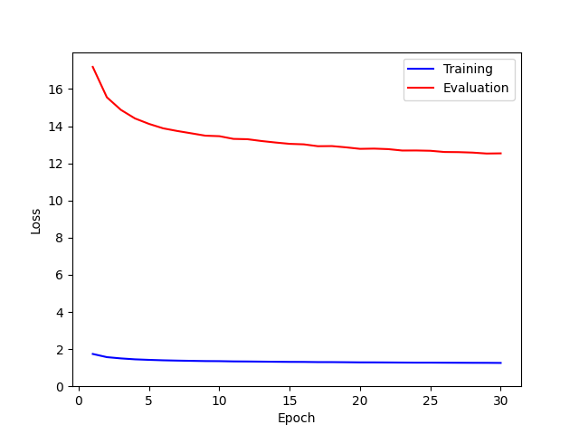
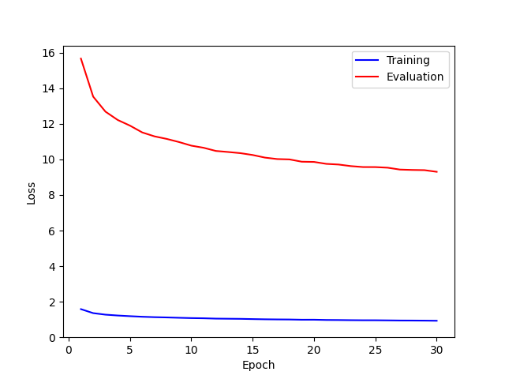

# The Peformance of Deformable Convolution on PyTorch

Compare the peformance of Conv2d, DeformConv2d and DeformConv2d v2.

## Install

Clone repo and install requirements.txt in a [**Python=3.11.4**](https://www.python.org/downloads/release/python-3114/) environment, including [**PyTorch=2.0.1**](https://pytorch.org/get-started/locally/).

```python
git clone https://github.com/hrmc2022/PyTorch-Image-Segmentation
cd PyTorch-Image-Segmentation
pip install -r requirements.txt
```

To use GPU, install CUDA Toolkit

- CUDA 11.8
  - [CUDA Toolkit 11.8 Downloads | NVIDIA Developer](https://developer.nvidia.com/cuda-11-8-0-download-archive)

## Dataset
- CIFAR-10

## Model
- Conv2d
- DeformConv2d
- DeformConv2d v2

## Training Code Example

1. Setting json. The parameter is below.
    - outdir (string): The output directry.
    - model_type (int): Choose the model.<br>
        1. Conv2d
        2. DeformConv2d
        3. DeformConv2d v2
    - conv_ch (list): The channels of the convlution layers.
    - batch_size (int): The batch size.
    - test_size (float): The ratio of the size of the evaluation dataset.
    - random_seed (int): The random seed.
    - learning_rate (float): The learning rate of the optimizer.
    - weight_decay (float): The coefficient of the weight decay of the opetimizer.
    - num_epoch (int): The number of epochs to train.
    - save_epoch_freq (int): The frequency of saving the model.
2. Train
    - Conv2d
        ```
        python train_Conv2d.py --config=./config/train_Conv2d.json
        ```

## Test Code Example

1. Setting json. The parameter is below.
    - outdir (string): The output directry.
    - model_type (int): Choose the model.<br>
        1. Conv2d
        2. DeformConv2d
        3. DeformConv2d v2
    - model (string): The path of the trained model.
    - conv_ch (list): The channels of the convlution layers.
    - batch_size (int): The batch size.
2. Test
    - Conv2d
        ```
        python test_Conv2d.py --config=./config/test_Conv2d.json
        ```

## Training Result

The training and evaluation losses are blow.

<table>
  <caption>Training Result</caption>
  <thead>
    <tr>
      <th>Conv2d</th> <th>DeformConv2d</th> <th>DeformConv2d v2</th>
    </tr>
  </thead>
  <tr>
    <td>  </td> <td></td> <td></td>
  </tr>
</table>

## Test Result

The test socre (accuray) of each model is below. The Deformable Convolution v2 is the best.

<table>
  <caption>Test Result</caption>
  <thead>
    <tr>
      <th>Conv2d</th> <th>DeformConv2d</th> <th>DeformConv2d v2</th>
    </tr>
  </thead>
  <tr>
    <td> 0.5538138747215271 </td> <td>0.6718250513076782</td> <td>0.6987819671630859</td>
  </tr>
</table>


## Reference
- https://pytorch.org/vision/main/generated/torchvision.ops.deform_conv2d.html#torchvision.ops.deform_conv2d